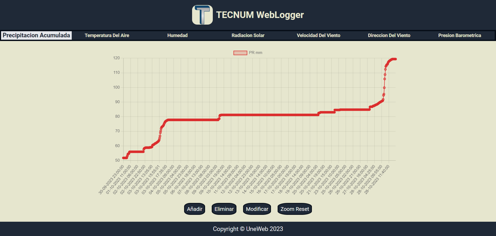

# WebLogger UneWeb

> A Web Page consisting of several graphs connected to a Database.

The Web Page has several functions that allow the user to interact with the Graphics, such as:

- An "Add" function that allows a piece of data to be entered into any of the graphs.

- A "Delete" function that allows deleting a data in any of the graphs.

- A "Modify" function that allows to select a data in any of the graphs and change its information.

- A "Zoom" and "Pan" function that allows you to zoom and pan through the graphs, together with a "Reset" button to quickly return to the original state of the graphs.

## Built With

- HTML5
- CSS3
- JavaScript
- JQuery
- HammerJS

## Live Demo

[Live Demo Link](https://webloggerpage.000webhostapp.com/)

## Getting Started

1. You only need to clone this repo on your local machine.

To get a local copy up and running follow these simple example steps.

### Prerequisites

To make this repository working in your local machine you need only a browser.

<!-- ### Setup

### Install

### Usage

### Run tests

### Deployment -->

## Authors

👤 **Daniel Enrique Santander Finol**

- GitHub: [@Danielfinx](https://github.com/Danielfinx)
- LinkedIn: [LinkedIn](https://www.linkedin.com/in/daniel-santander-ab260b228/)

## 🤝 Contributing

Contributions, issues, and feature requests are welcome!

Feel free to check the [issues page](https://github.com/Danielfinx/Proyecto-Daniel_TECNUM_WebLogger_UneWeb/issues).

## Show your support

Give a ⭐️ if you like this project!

## Acknowledgments

- Aristides Molina ([@aristides1000](https://github.com/aristides1000)) tutor of UneWeb.
- Google: For letting us find crucial information in order to create this project.

## 📝 License

This project is [CC0 1.0 Universal](LICENSE) licensed.
